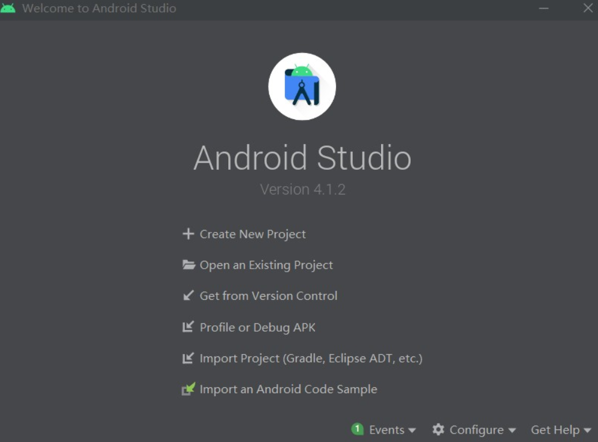
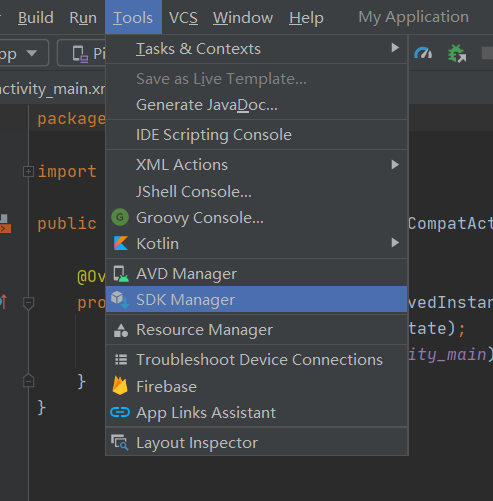
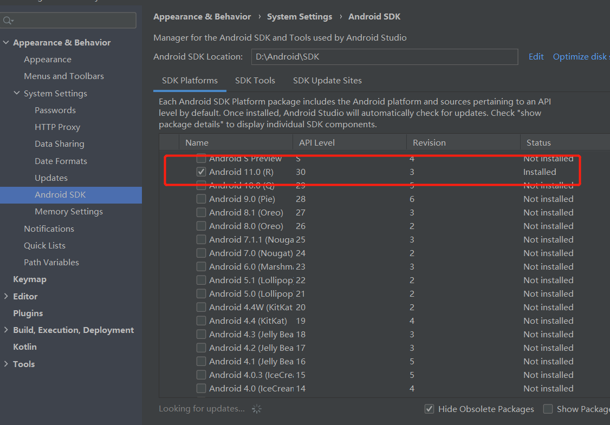
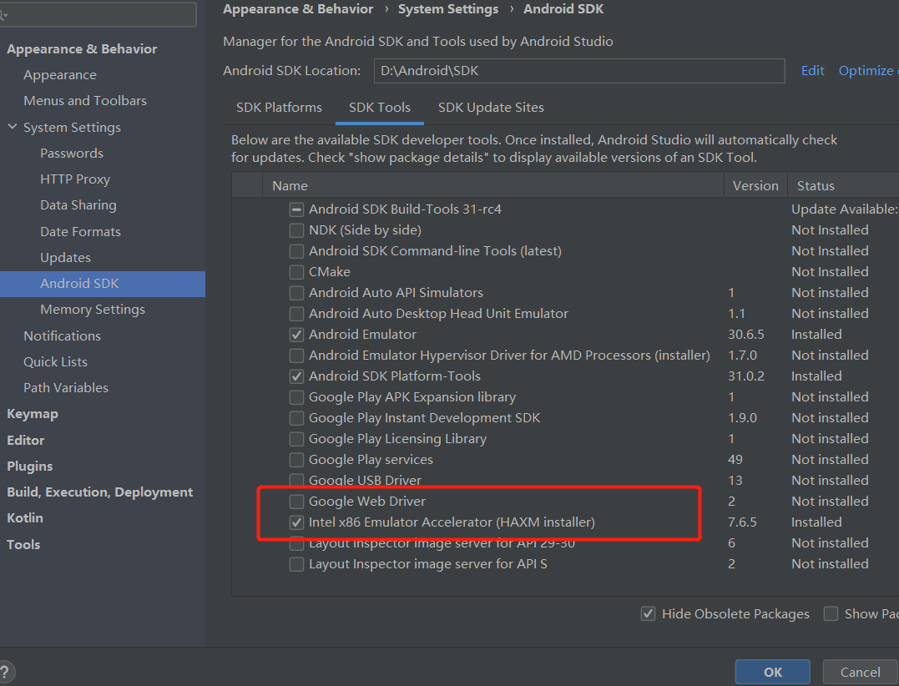
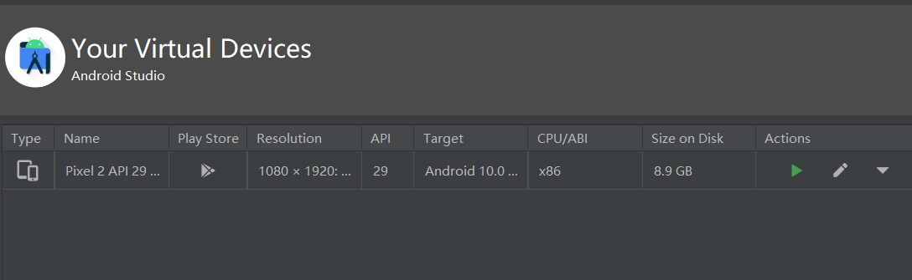
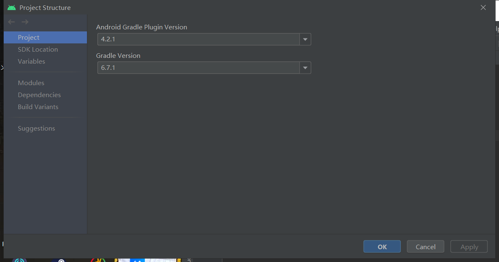

# 实验五：Android模拟器环境搭建

# 实验要求

- [x] 安装和配置 Java SDK

- [x] 安装Android Studio

- [x] 下载安装 Android SDK

- [x] 配置 Android 模拟器运行环境

- [x] 配置 Gradle 编译环境

# 实验环境

- Windows 10

- Java SE Development Kit 11

- Android Studio -  4.1.2 for Windows 64-bit

# 实验过程

## 安装Android Studio

前往[官方网站](https://developer.android.com/studio)下载客户端，按需安装

## 下载安装 Android SDK

通过启动界面的菜单选项 Configure -> SDK Manager 启动 SDK Manager:

选择Android 11.0版本的SDK，直接进行安装即可：

## 配置 Android 模拟器运行环境

安装Intel x86 Emulator Accelerator (HAXM installer)

创建AVD：

模拟器实际运行的效果：

## 配置 Gradle 编译环境

查看Android Studio内置Gradle及其插件版本信息：

## 问题
首先就是完全不了解这个Android模拟器，安装开始遇到了些常识性问题（太cai）,通过百度经验和一些教程，顺畅多了。

# 参考资料

[老师课本](https://c4pr1c3.github.io/cuc-mis/chap0x05/exp.html)
[Android Studio安装配置详细步骤（超详细）](https://blog.csdn.net/weixin_43883917/article/details/108942788)
[Android Studio入门教程（新手必看）](https://blog.csdn.net/weixin_43883917/article/details/108950310)