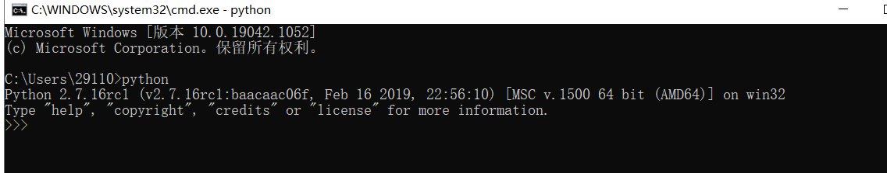

# 实验八 Android 缺陷应用漏洞攻击实验

## 实验目的

- 理解 Android 经典的组件安全和数据安全相关代码缺陷原理和漏洞利用方法

- 掌握 Android 模拟器运行环境搭建和 `ADB` 使用

## 实验环境

- Android-InsecureBankv2

- Android Studio Arctic Fox | 2020.3.1 Beta 4

- Android 11.0 API 30 x86 - Pixel 2

- Android 11.0 API 30 x86 - Pixel 4 XL

- Python 2.7

## 实验要求

- [x] 详细记录实验环境搭建过程；

- [x] 至少完成以下实验：

    - [x] Developer Backdoor
    - [x] Insecure Logging
    - [x] Android Application patching + Weak Auth
    - [x] Exploiting Android Broadcast Receivers
    - [x] Exploiting Android Content Provider


- [] （可选）使用不同于 Walkthroughs 中提供的工具或方法达到相同的漏洞利用攻击效果；
    - 推荐 drozer

## 实验过程

### 搭建InsecureBankv2环境

- 使用的Python环境

    

- [InsecureBankv2](https://github.com/c4pr1c3/Android-InsecureBankv2)代码下载

-  `AndroLabServer` 文件夹下载安装包

    ```bash
    pip install -r requirements.txt
  
    ```

    

    

- 将 `Android-InsecureBankv2` 文件夹下的 `InsecureBankv2.apk` 安装进模拟器

    ```bash
    adb install InsecureBankv2.apk
    ```

    

- 配置 `Preferences` ，使用 `cmd` ，默认配置即可

    

- 使用 `jack/Jack@123$` 或者 `dinesh/Dinesh@123$` 即可登陆成功

    

---

### 1-Developer Backdoor

- 找到如下代码，从而得知走后门账户为 `Devadmin`

    

- 使用后门账户时，密码任意即可登录

    

- 登陆成功

    

---

### 3-Insecure Logging

- 抓取日志

    ```bash
    adb logcat
    ```

- 使用 `jack/Jack@123$` 登录

    

- 

- 进入修改密码界面，将密码修改为 `Jack@1234` ，从日志中能找到对应操作

    

- 使用 `Devadmin/任意密码`登录
  
    
---

###  3-Android Application patching + Weak Auth
####  配置

* `Android-InsecureBankv2 apk`
* `Android SDK`

* `apktool`

* `SignApk`

  ```bash
  # 安装
  git clone https://github.com/appium-boneyard/sign.git
  ```

  

####  步骤:

+  安装`InsecureBankv2.apk`到模拟器
+ 在模拟器中启动`InsecureBankv2.apk`

+ 将`InsecureBankv2.apk`复制到`apktool`目录下，并输入命令反汇编

   因为第七章实验中已经将`apktool`的路径加入了环境变量，所以在任何目录下可以执行反编译命令

   ```bash
   # apktool 安装见第七章实验
   # 直接在"...\Android-InsecureBankv2\"目录下执行
   
   apktool d InsecureBankv2.apk -o InsecureBankv2-smali
   # -o <dir> 指定反汇编结果保存文件夹，默认为[ApkName]
   ```

   

   反汇编成功

+ 导航到`...\Android-InsecureBankv2\InsecureBankv2-smali\res\values\`，打开`String.xml`进行编辑

   

   修改好后保存

+ 导航回到`...\Android-InsecureBankv2`，重新编译：

   ```bash
   apktool b InsecureBankv2-smali
   ```

   

+  对新生成的`apk`文件签名（不签名无法安装）

   ```bash
   cd InsecureBankv2-smali\dist
   C:\Users\mengli\AppData\Local\Android\Sdk\build-tools\30.0.2\apksigner sign --min-sdk-version 19 --ks D:\keystore0622.jks --out InsecureBankv2-signed.apk InsecureBankv2.apk
   ```

   

+ 安装`InsecureBankv2-signed.apk`到模拟器中

   ```bash
   # 先卸载
   adb install  InsecureBankv2-signed.apk
   ```

   

+ 在模拟器中启动新安装的`InsecureBankv2`，发现界面多了一个额外的`Create user`按钮。
   
   


### 4-Exploiting Android Broadcast Receivers

#### 步骤

  + 安装`InsecureBankv2.apk`到模拟器

  + 在模拟器中启动`InsecureBankv2.apk`

  + 将`InsecureBankv2.apk`复制到`apktool`目录下，并输入命令反编译

+ 打开解密的`AndroidManifest.xml`文件

   


+ 应用程序中声明的`Broadcast Receiver`的参数

   

   

+  在模拟器上安装：`adb install InsecureBankv2.apk`

+ 打开应用 ，注意并不需要输入用户名和密码登录

+ 在命令行中打开`adb shell`

   
+ 输入下面的命令

    ```bash
    am broadcast -a theBroadcast -n com.android.insecurebankv2/com.android.insecurebankv2.MyBroadCastReceiver --es phonenumber 5554 --es newpass Dinesh@123!
    ```

    

+ 回到模拟器中，打开`Messages`应用，发现

    上述输入的命令自动发送短信联系上述广播接收器，并发送带有密码的短信文本

+ 手动修改，也会有`修改请求`和`修改成功`的短信记录

在`app`中手动修改密码也会有`修改请求`和`修改成功`的短信记录，如果窃取到短信记录，就会泄露信息。

### 5-Exploiting Android Content Provider

- 使用 `dinesh/Dinesh@123$` 和 `jack/Jack@123$` 先后登陆

- 同上述实验对 `apk` 文件进行反编译，找到反编译后的 `AndroidManifest.xml` 文件，找到如下代码：

    

- 同上述实验对 `InsecureBankv2.apk` 进行逆向操作，用 `JADX` 直接打开 `jar` 文件，找到如下代码：

    

- 将 `InsecureBankv2.apk` 复制到 `Android SDK` 的 `platform-tools` 文件夹下，在模拟器运行时，执行以下命令：

    ```bash
    adb install InsecureBankv2.apk
    ```

- 再次打开 `InsecureBankv2`

- 回到 `platform-tools` 文件夹并在命令行执行以下命令：

    ```bash
    adb shell content query --uri content://com.android.insecurebankv2.TrackUserContentProvider/trackerusers
    ```

- 获得记录

    

--- 


## 实验总结

+ 可以使用工具绕过登录直接修改用户密钥。

+ 在`app`中手动修改密码也会有`修改请求`和`修改成功`的短信记录，如果窃取到短信记录，就会泄露信息。
  
+ `apk`文件可以使用`apktool`等工具进行反编译，通过修改反编译出来的代码，再重打包重签名，可以轻易绕过脆弱认证，获取`admin`权限。

## 参考资料

- [第八章实验](https://c4pr1c3.github.io/cuc-mis/chap0x08/homework.html)

- [移动互联网安全（2021）](https://www.bilibili.com/video/BV1rr4y1A7nz?p=162)


- [解决"pip Fatal error in launcher: Unable to create process using ... "的错误](https://blog.csdn.net/weixin_39278265/article/details/82938270)

- [python：python2与python3共存时，pip冲突，提示Fatal error in launcher: Unable to create process using '"d:\python27\python2.exe" "D:\Python27\Scripts\pip2.exe" '](https://www.cnblogs.com/gcgc/p/11127113.html)

- [Win10环境中如何实现python2和python3并存](https://www.jb51.net/article/191184.htm)


- [drozer安装使用教程（Windows）](https://www.cnblogs.com/lsdb/p/9441813.html)
- [使用adb shell 出现bash: adb: command not found...问题的解决方法](https://blog.csdn.net/gaojin1991/article/details/7894446)

